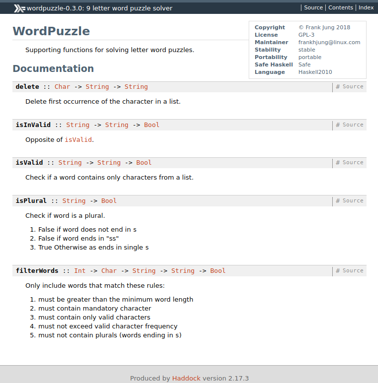

# Haskell 9 Letter Word Puzzle Solver

Solve 9 letter word puzzles like:

* [Nine Letter Word](http://nineletterword.tompaton.com/adevcrsoi/)
* [Your Word Life](http://www.yourwiselife.com.au/games/9-letter-word/)


Here we are using a subset of the British dictionary from the
[wbritish](https://packages.debian.org/sid/text/wbritish) package.

## Method

This program is used to list all words from this popular puzzle.
A brief outline of what this program does is:

* get user input of:
  * minimum word length
  * mandatory letter required in each word
  * letters as one string
  * [optional] dictionary to use to search for matching words

* print each word in dictionary that satisfies:
  * word is greater than or equal to minimum character length
  * word contain mandatory character
  * word contains other characters in correct frequencies

## How to run

When specifying a dictionary use (default is "dictionary"):

```bash
stack exec -- wordpuzzle 4 c adevcrsoi dictionary
```

To show order of word size use:

```bash
stack exec -- wordpuzzle 4 c adevcrsoi dictionary | gawk '{print length($0), $0; | "sort"}'
```

## Documentation

Documentation is built using [Haddock](https://www.haskell.org/haddock/):


