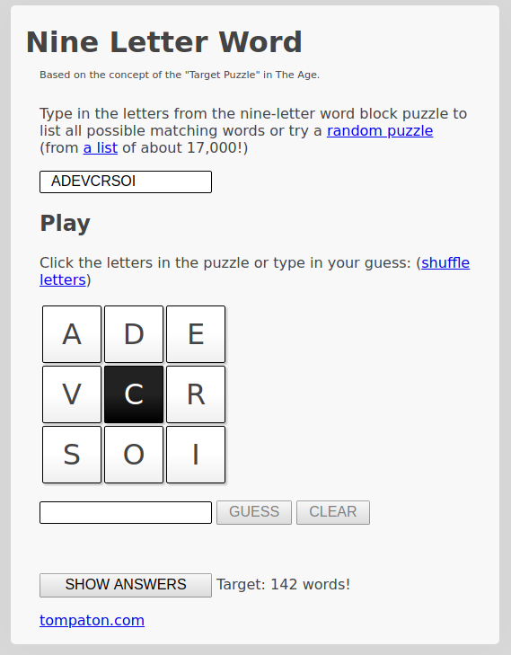
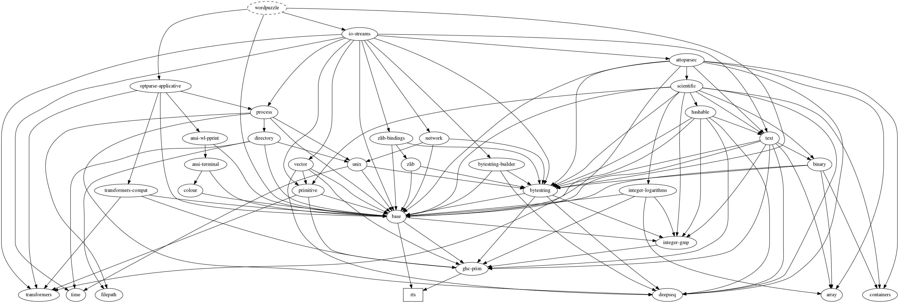

# Haskell 9 Letter Word Puzzle Solver

Solve 9 letter word puzzles like:

- [Nine Letter Word](http://nineletterword.tompaton.com/adevcrsoi/)
- [Your Word Life](http://www.yourwiselife.com.au/games/9-letter-word/)



Here we are using a subset of the British dictionary from the
[wbritish](https://packages.debian.org/sid/text/wbritish) package.

## Documentation

- [GitHub](https://frankhjung.github.io/haskell-wordpuzzle/)
  - [haddock function documentation](https://frankhjung.github.io/haskell-wordpuzzle/index.html)
  - [criterion performance measurements](https://frankhjung.github.io/haskell-wordpuzzle/benchmark.html)
- [GitLab](https://frankhjung1.gitlab.io/haskell-wordpuzzle/)
  - [haddock function documentation](https://frankhjung1.gitlab.io/haskell-wordpuzzle/index.html)
  - [criterion performance measurements](https://frankhjung1.gitlab.io/haskell-wordpuzzle/benchmark.html)

## Pipelines

- [GitHub](https://github.com/frankhjung/haskell-wordpuzzle/actions)
- [GitLab](https://gitlab.com/frankhjung1/haskell-wordpuzzle/pipelines)

## Package Dependencies

To include a package:

- update cabal sections with package with version
- run `cabal update`
- run `cabal build`
- run `make clean default`

## Build

This project can be built using either [cabal](https://www.haskell.org/cabal/)
or [stack](https://docs.haskellstack.org/en/stable/).

The default [Makefile](Makefile) builds using the
[cabal](https://www.haskell.org/cabal/) tool.

To build using [stack](https://docs.haskellstack.org/en/stable/):

```bash
make -f stack.mak [target]
```

Stack is required for GitHub pipelines as it provides the correct Haskell
version.

### Upgrading GHC

When updating the GHC version:

1. Run `make cleanall` to remove the old build artifacts.
1. Remove the `cabal.project.freeze` file.
1. Update the `cabal.project` file with the new LTS version.
1. Run `cabal update` to update the package list.
1. Run `make` to rebuild the project.
1. Run `cabal freeze` to create a new `cabal.project.freeze` file.

## Solver

This program is used to list all words from this popular puzzle.
A brief outline of what this program does is:

- get user input of:

  - minimum word length
  - mandatory letter required in each word
  - letters as one string
  - (optional) dictionary to use to search for matching words

- print each word in dictionary that satisfies:
  - word is greater than or equal to minimum character length
  - word contain mandatory character
  - word contains other characters in correct frequencies

## How to run

### Using Make

For example to call word puzzle solver from `make`:

```bash
make ARGS='-s 4 -m c -l adevcrsoi -d/usr/share/dict/words -h' exec
```

Or run using default dictionary:

```bash
make exec
```

### Help

Get command line help:

```bash
$ wordpuzzle --help
https://github.com/frankhjung/haskell-wordpuzzle

Usage: wordpuzzle [-s|--size INT] (-m|--mandatory CHAR) (-l|--letters STRING)
                  [-d|--dictionary FILENAME]
  Solve word puzzles like those at nineletterword.tompaton.com

Available options:
  -s,--size INT            Minimum word size (value from 1..9) (default: 4)
  -m,--mandatory CHAR      Mandatory character for all words
  -l,--letters STRING      Nine letters to make words
  -d,--dictionary FILENAME Dictionary to read words from (default: "dictionary")
  -h,--help                Show this help text

Version: 0.7.6
```

Or call without command line arguments:

```bash
$ wordpuzzle
Missing: (-m|--mandatory CHAR) (-l|--letters STRING)

Usage: wordpuzzle [-s|--size INT] (-m|--mandatory CHAR) (-l|--letters STRING)
                  [-d|--dictionary FILENAME]
  Solve word puzzles like those at nineletterword.tompaton.com
```

### Default Dictionary

When specifying a dictionary use (default is "dictionary"):

```bash
wordpuzzle -m c -l adevcrsoi -ddictionary
```

### Sort Words by Size

To show words by size use:

```bash
wordpuzzle -m c -l adevcrsoi | gawk '{print length($0), $0;}' | sort -r
```

## Unit Tests

Using [HSpec](https://hspec.github.io/):

```text
wordpuzzle-0.7.5: test (suite: test)

Progress 1/2: wordpuzzle-0.7.5
remove
  when character is in list
    returns list less that character
  when character is in list twice
    returns list less one instance of that character
  when character is not in list
    returns original list
isValid
  when word containing characters
    returns true
  when word containing a valid subset of characters
    returns true
  when word does not contain valid characters
    returns false
  when word does not contain valid character frequency
    returns false

Finished in 0.0008 seconds
7 examples, 0 failures

wordpuzzle-0.7.5: Test suite test passed
Completed 2 action(s).
```

## Performance

### Benchmarks

To enable benchmarks with [Cabal](https://www.haskell.org/cabal/) call:

```bash
cabal configure --enable-benchmarks
```

Then to run Criterion benchmarks call:

```bash
cabal bench
```

```text
wordpuzzle-0.7.5: benchmarks
Running 1 benchmarks...
Benchmark benchmark: RUNNING...
benchmarking WordPuzzle/isValid
time                 15.69 ns   (15.57 ns .. 15.81 ns)
                     1.000 R²   (0.999 R² .. 1.000 R²)
mean                 15.63 ns   (15.56 ns .. 15.74 ns)
std dev              299.7 ps   (237.7 ps .. 389.1 ps)
variance introduced by outliers: 28% (moderately inflated)

benchmarking WordPuzzle/remove
time                 16.54 ns   (15.82 ns .. 17.51 ns)
                     0.984 R²   (0.969 R² .. 0.999 R²)
mean                 16.26 ns   (15.94 ns .. 16.95 ns)
std dev              1.518 ns   (819.1 ps .. 2.507 ns)
variance introduced by outliers: 91% (severely inflated)

Benchmark benchmark: FINISH
```

### Execution Summary

Using the dictionary sited above, the run time performance for the example:

```text
$ wordpuzzle -s 4 -m c -l adevcrsoi -ddictionary +RTS -s 1>/dev/null
     250,717,968 bytes allocated in the heap
         202,096 bytes copied during GC
         119,944 bytes maximum residency (5 sample(s))
          27,816 bytes maximum slop
               3 MB total memory in use (0 MB lost due to fragmentation)

                                     Tot time (elapsed)  Avg pause  Max pause
  Gen  0       231 colls,     0 par    0.004s   0.004s     0.0000s    0.0007s
  Gen  1         5 colls,     0 par    0.001s   0.001s     0.0003s    0.0004s

  TASKS: 4 (1 bound, 3 peak workers (3 total), using -N1)

  SPARKS: 0 (0 converted, 0 overflowed, 0 dud, 0 GC'd, 0 fizzled)

  INIT    time    0.001s  (  0.007s elapsed)
  MUT     time    0.122s  (  0.134s elapsed)
  GC      time    0.005s  (  0.005s elapsed)
  EXIT    time    0.001s  (  0.004s elapsed)
  Total   time    0.129s  (  0.150s elapsed)

  Alloc rate    2,053,382,211 bytes per MUT second

  Productivity  95.5% of total user, 91.8% of total elapsed

gc_alloc_block_sync: 0
whitehole_spin: 0
gen[0].sync: 0
gen[1].sync: 0
```

## Command Line Parsers

Apart from solving a simple word puzzle this project also explores the following
command line parsers:

- [System.Environment getArgs](https://hackage.haskell.org/package/base/docs/System-Environment.html)
- [System.Console GetOpt](https://hackage.haskell.org/package/base/docs/System-Console-GetOpt.html)
- [optparse-applicative](https://hackage.haskell.org/package/optparse-applicative)

Each is preserved in a separate Git [branch](https://github.com/frankhjung/haskell-wordpuzzle/branches).

## Package Version

The version is dynamically included from the
[Cabal](https://www.haskell.org/cabal/users-guide/developing-packages.html#accessing-data-files-from-package-code)
configuration file.

Version 0.7.6 of this project is using [LTS Haskell 12.26
(ghc-8.4.4)](https://www.stackage.org/lts-12.26)

## Dependencies Graph

To produce a package dependencies graph, run:

```bash
stack dot --external | dot -Tpng -o doc/dependencies.png
```



## References

### Haskell Build

Either of the following build tools can be used:

- [Cabal](https://www.haskell.org/cabal/)
- [Stack](https://docs.haskellstack.org/en/stable/)

### Haddock Documentation

Documentation is built using [Haddock](https://www.haskell.org/haddock/).

Included in this repository is generated documentation for the current version.

- [haddock function documentation](./doc/html/wordpuzzle/index.html)
- [criterion performance benchmarks](./doc/benchmark.html)

## Other Implementations

- [Clojure](https://gitlab.com/frankhjung1/clojure-wordpuzzle)
- [Haskell](https://gitlab.com/frankhjung1/haskell-wordpuzzle)
- [Java](https://gitlab.com/frankhjung1/java-wordpuzzle)
- [Kotlin](https://gitlab.com/frankhjung1/kotlin-wordpuzzle)
- [Go](https://gitlab.com/frankhjung1/go-wordpuzzle)
- [Python](https://gitlab.com/frankhjung1/python-wordpuzzle)
