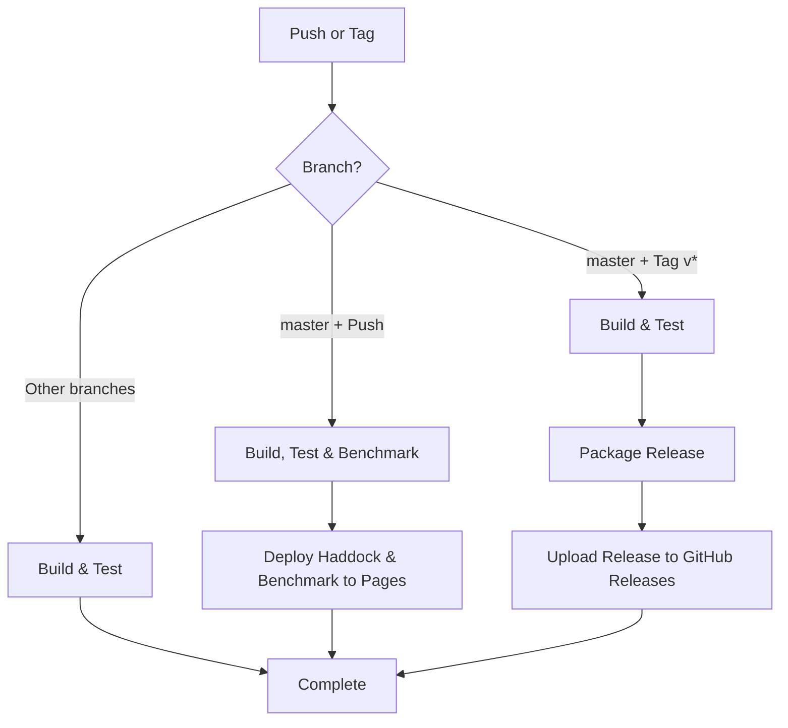
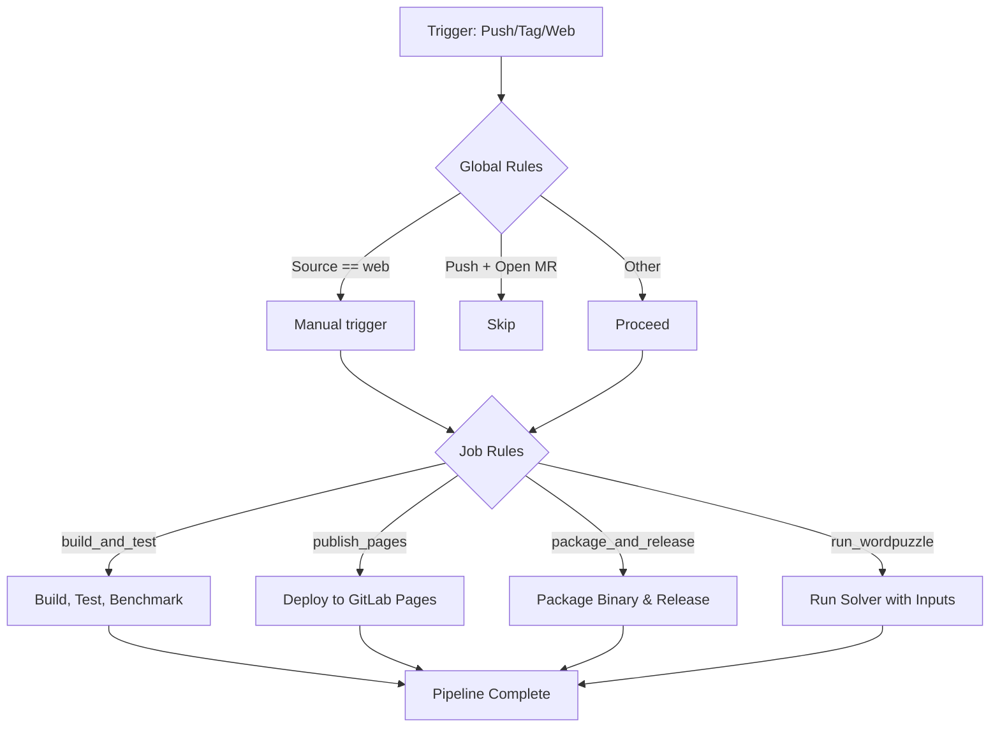

# Haskell 9 Letter Word Puzzle Solver

Solve 9 letter word puzzles like:

- [Nine Letter Word](http://nineletterword.tompaton.com/adevcrsoi/)
- [Your Word Life](http://www.yourwiselife.com.au/games/9-letter-word/)
- [NYT Spelling Bee](https://www.nytimes.com/puzzles/spelling-bee) (using
  `--repeats`) -
  [Scientific American Spellements](https://www.scientificamerican.com/game/spellements/)
  (using `--repeats`)


The default dictionary used by the project is the Debian `wamerican` word list.
Package metadata for reference:

| Field | Value |
| :--- | :--- |
| Package | [wamerican](https://packages.debian.org/search?keywords=wamerican) |
| Version | 2020.12.07-4 |
| Priority | standard |
| Section | text |
| Source | scowl |
| Maintainer | Don Armstrong <don@debian.org> |
| Homepage | <http://wordlist.sourceforge.net/> |

## Code Documentation

Generated haddock gets written to a build-specific path under `dist-newstyle`.
The exact subdirectory depends on the GHC version and architecture, so we use a
glob to copy the `wordpuzzle` html output into the repository tree for a
permanent record. Git pipelines produce the same documentation and deploy it to
GitHub Pages and GitLab Pages.

```bash
cp -r \
  dist-newstyle/build/*/wordpuzzle-*/x/wordpuzzle/doc/html/wordpuzzle/wordpuzzle/* \
  doc/html/wordpuzzle/
```

Alternatively run `make copy`, which performs the copy automatically.

- [GitHub](https://frankhjung.github.io/haskell-wordpuzzle/)
  - [haddock function documentation](https://frankhjung.github.io/haskell-wordpuzzle/index.html)
  - [criterion performance measurements](https://frankhjung.github.io/haskell-wordpuzzle/benchmark.html)
- [GitLab](https://frankhjung1.gitlab.io/haskell-wordpuzzle/)
  - [haddock function documentation](https://frankhjung1.gitlab.io/haskell-wordpuzzle/index.html)
  - [criterion performance measurements](https://frankhjung1.gitlab.io/haskell-wordpuzzle/benchmark.html)

## Deployment

- GitHub Actions: <https://github.com/frankhjung/haskell-wordpuzzle/actions>
  - Workflow files: [.github/workflows/cicd.yml](.github/workflows/cicd.yml),
    [.github/workflows/run-wordpuzzle.yml](.github/workflows/run-wordpuzzle.yml)
- GitLab CI: <https://gitlab.com/frankhjung1/haskell-wordpuzzle/pipelines>
  - Config: [.gitlab-ci.yml](.gitlab-ci.yml)

### Pipeline Rules

Refer to the workflow diagrams below for detailed execution flow across GitHub
Actions and GitLab CI.

### Running from GitHub Actions

A manual workflow (`.github/workflows/run-wordpuzzle.yml`) is available that
fetches the release artefact produced by the build pipeline and executes it on a
minimal runner. Dispatch the workflow from the **Actions** tab and supply the
following inputs:

- `SIZE` – minimum word size (defaults to 4)
- `LETTERS` – letters to use (first character becomes the mandatory letter)
- `REPEATS` – boolean flag to allow repeated letters (Spelling Bee)

The workflow simply mirrors the local command line usage, e.g.:

```bash
./wordpuzzle --size=6 --letters=cadevrsoi --repeats
```

See `doc/deployment.md` for more background on how the run pipeline is
constructed and how the release artefact is packaged.

### GitLab Workflow Rules (Global)

These rules determine if a pipeline is created at all.

| Condition | Action | Reason |
| :--- | :--- | :--- |
| **Source is "web"** | **Run** | Allows manual execution of the solver pipeline. |
| **Branch Push + Open Merge Request** | **Skip** | Prevents duplicate pipelines (standard GitLab optimization). |
| **All other cases** | **Run** | Allows standard push and tag pipelines to proceed. |

### GitLab Job-Specific Rules

These rules determine which jobs run within a created pipeline.

| Job | Trigger Condition | Skip Condition | Description |
| :--- | :--- | :--- | :--- |
| **`build_and_test`** | Automatic events (Push, Tag, Schedule) | Manual "Web" triggers | Builds, tests, and benchmarks the code. Skipped during manual solver runs to save time. |
| **`publish_pages`** | Push to `master` branch | Web triggers, Tags, Non-master branches | Deploys Haddock documentation and benchmarks to GitLab Pages. |
| **`package_and_release`** | Tag starting with `v` (e.g., `v1.0.1`) | Web triggers, Branch pushes | Packages the binary and dictionary, uploads them to the Registry, and creates a GitLab Release. |
| **`run_wordpuzzle`** | Manual "Web" triggers | Automatic events (Push, Tag) | The interactive solver. Runs only when inputs (`SIZE`, `LETTERS`, etc.) are provided via the "Run pipeline" UI. |

#### GitHub Actions Workflow Diagram



#### GitLab CI Workflow Diagram



## Package Dependencies

To include a package:

- update the cabal sections with the package and version
- run `cabal update`
- run `cabal build`
- run `make clean default`

## Build

This project can be built using either [cabal](https://www.haskell.org/cabal/)
or [stack](https://docs.haskellstack.org/en/stable/).

The default [Makefile](Makefile) builds using the
[cabal](https://www.haskell.org/cabal/) tool.

To build using [stack](https://docs.haskellstack.org/en/stable/):

```bash
make -f stack.mk [target]
```

Stack is required for GitHub pipelines as it provides the correct Haskell
version.

### Upgrading GHC

When updating the GHC version:

1. Run `make cleanall` to remove the old build artifacts.
1. Remove the `cabal.project.freeze` file.
1. Update the `cabal.project` file with the new LTS version.
1. Run `cabal update` to update the package list.
1. Run `make` to rebuild the project.
1. Run `cabal freeze` to create a new `cabal.project.freeze` file.

## Solver Overview

This program solves word puzzles by listing all words that satisfy:

- **Input:** minimum word length, letters (with first character mandatory), and
  optional dictionary file
- **Match criteria:**
  - word length ≥ minimum size
  - contains the mandatory character (first letter)
  - uses only valid characters in correct frequencies
- **Special mode:** when `--repeats` is enabled, letters can repeat and there is
  no 9-letter upper bound

## Validation Rules

The project uses the
[validation](https://hackage.haskell.org/package/validation) library to provide
comprehensive error reporting for command line parameters. Instead of stopping
at the first error, it collects all validation failures and reports them
together.

Validations performed include:

- Minimum word size must be between 4 and 9 letters (inclusive).
- Letters string must contain between 4 and 9 unique lowercase letters (no
  repeated letters).

## How to run

### Basic usage

Run with custom letters and dictionary:

```bash
make ARGS='-s 6 -l cadevrsoi -d /usr/share/dict/words' exec
```

Run with default dictionary (4–9 letter words):

```bash
make ARGS='-s 6 -l cadevrsoi' exec
```

Run with letter repeats allowed (Spelling Bee mode):

```bash
make ARGS='-s 7 -l mitncao -r' exec
```

### Command-line help

View help and version information:

```bash
$ wordpuzzle --help
https://github.com/frankhjung/haskell-wordpuzzle

Usage: wordpuzzle [-s|--size INT] (-l|--letters STRING)
                  [-d|--dictionary FILENAME] [-r|--repeats]

  Solve word puzzles

Available options:
  -s,--size INT            Minimum word size (value from 4..9) (default: 4)
  -l,--letters STRING      Letters to make words (4 to 9 unique lowercase
                           letters)
  -d,--dictionary FILENAME Dictionary to search for words
                           (default: "dictionary")
  -r,--repeats             Allow letters to repeat (like Spelling Bee)
  -h,--help                Show this help text

Version: 1.0.1
```

Missing arguments:

```bash
$ cabal exec wordpuzzle --
Missing: (-l|--letters STRING)
```

### Dictionary setup

Generate the default `dictionary` file:

```bash
make dictionary
```

This filters `/usr/share/dict/words` (when available) to extract 4+ letter
words.

Alternatively, specify a custom dictionary:

```bash
cabal exec wordpuzzle -- -l cadevrsoi -d dictionary
```

Or download a larger dictionary:

```bash
curl -fS -s https://raw.githubusercontent.com/dwyl/english-words/master/words.txt -o dictionary
LC_ALL=C grep -E '^[a-z]{4,}$$' dictionary | sort -u > dictionary.filtered
mv dictionary.filtered dictionary
```

The default dictionary is sourced from the
[wamerican](https://packages.debian.org/search?keywords=wamerican) package.

### Sort Words by Size

To show words by size use:

```bash
cabal exec wordpuzzle -- -l cadevrsoi | gawk '{print length($0), $0;}' | sort -r
```

## Unit Tests

Using [HSpec](https://hspec.github.io/):

```text
$ cabal test --test-show-details=direct
...
Finished in 0.00xx seconds
23 examples, 0 failures
Test suite test: PASS
```

## Performance

### Benchmarks

To enable benchmarks with [Cabal](https://www.haskell.org/cabal/) call:

```bash
cabal configure --enable-benchmarks
```

Then to run Criterion benchmarks call:

```bash
cabal bench
```

```text
$ cabal bench
Build profile: -w ghc-9.6.7 -O1
In order, the following will be built (use -v for more details):
 - wordpuzzle-1.0.1 (bench:benchmark) (ephemeral targets)
Preprocessing benchmark 'benchmark' for wordpuzzle-1.0.1...
Building benchmark 'benchmark' for wordpuzzle-1.0.1...
Running 1 benchmarks...
Benchmark benchmark: RUNNING...
benchmarking WordPuzzle/nineLetters
time                 224.3 ns   (221.5 ns .. 226.6 ns)
                     0.999 R²   (0.998 R² .. 0.999 R²)
mean                 224.9 ns   (222.5 ns .. 226.4 ns)
std dev              6.349 ns   (4.298 ns .. 9.762 ns)
variance introduced by outliers: 41% (moderately inflated)

benchmarking WordPuzzle/spellingBee
time                 171.1 ns   (170.9 ns .. 171.3 ns)
                     1.000 R²   (1.000 R² .. 1.000 R²)
mean                 170.9 ns   (170.8 ns .. 171.1 ns)
std dev              493.2 ps   (404.7 ps .. 634.4 ps)

Benchmark benchmark: FINISH
```

### Execution Summary

Using the dictionary sited above, the run time performance for the example:

```text
$ cabal exec wordpuzzle -- -s 7 -l cadevrsoi -d dictionary +RTS -s 1>/dev/null
     858,788,568 bytes allocated in the heap
       5,242,528 bytes copied during GC
         118,560 bytes maximum residency (2 sample(s))
          33,600 bytes maximum slop
               6 MiB total memory in use (0 MiB lost due to fragmentation)

                                     Tot time (elapsed)  Avg pause  Max pause
  Gen  0       206 colls,     0 par    0.005s   0.005s     0.0000s    0.0001s
  Gen  1         2 colls,     0 par    0.000s   0.000s     0.0001s    0.0002s

  TASKS: 4 (1 bound, 3 peak workers (3 total), using -N1)

  SPARKS: 0 (0 converted, 0 overflowed, 0 dud, 0 GC'd, 0 fizzled)

  INIT    time    0.000s  (  0.000s elapsed)
  MUT     time    0.241s  (  0.241s elapsed)
  GC      time    0.005s  (  0.005s elapsed)
  EXIT    time    0.000s  (  0.003s elapsed)
  Total   time    0.247s  (  0.250s elapsed)

  Alloc rate    3,557,834,378 bytes per MUT second

  Productivity  97.7% of total user, 96.4% of total elapsed
```

## Command Line Parsers

Apart from solving a simple word puzzle this project also explores the following
command line parsers:

- [System.Environment getArgs](https://hackage.haskell.org/package/base/docs/System-Environment.html)
- [System.Console GetOpt](https://hackage.haskell.org/package/base/docs/System-Console-GetOpt.html)
- [optparse-applicative](https://hackage.haskell.org/package/optparse-applicative)

Each is preserved in a separate Git
[branch](https://github.com/frankhjung/haskell-wordpuzzle/branches).

## Package Version

The version is dynamically included from the
[Cabal](https://www.haskell.org/cabal/users-guide/developing-packages.html#accessing-data-files-from-package-code)
configuration file.

Version 1.0.1 of this project is using [LTS Haskell 22.44
(ghc-9.6.7)](https://www.stackage.org/lts-22.44)

## Dependencies Graph

To produce a package dependencies graph, run:

```bash
stack dot --external | dot -Tpng -o doc/dependencies.png
```


## References

### Haskell Build

Either of the following build tools can be used:

- [Cabal](https://www.haskell.org/cabal/)
- [Stack](https://docs.haskellstack.org/en/stable/)

### Haddock Documentation

Documentation is built using [Haddock](https://www.haskell.org/haddock/).

Included in this repository is generated documentation for the current version.

- [haddock function documentation](./doc/html/wordpuzzle/index.html)
- [criterion performance benchmarks](./doc/benchmark.html)

## Other Implementations

- [Clojure](https://gitlab.com/frankhjung1/clojure-wordpuzzle)
- [Haskell](https://gitlab.com/frankhjung1/haskell-wordpuzzle)
- [Java](https://gitlab.com/frankhjung1/java-wordpuzzle)
- [Kotlin](https://gitlab.com/frankhjung1/kotlin-wordpuzzle)
- [Go](https://gitlab.com/frankhjung1/go-wordpuzzle)
- [Python](https://gitlab.com/frankhjung1/python-wordpuzzle)
